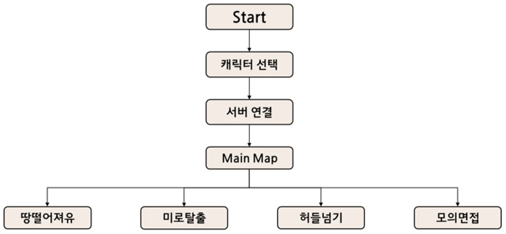
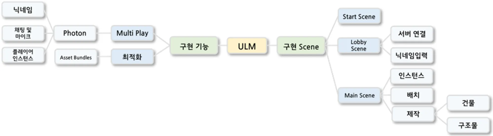
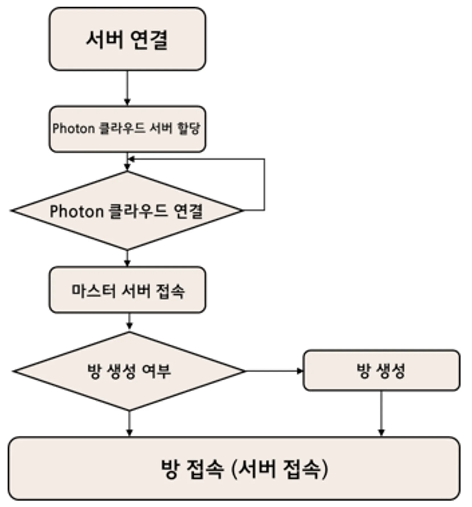

# 🎓 ULM ; Universe Life in Metaverse
 
 
## 프로젝트 소개
ULM은 학교 생활을 메타버스로 구현한 소셜 플랫폼입니다. 캠퍼스를 자유롭게 돌아다니며 다른 사용자들과 소통하고, 각 건물에서 특색 있는 미니게임을 즐길 수 있는 새로운 형태의 메타버스 플랫폼입니다.
 

 
 
 
 
## 🎯 주요 기능 
### 1. 메타버스 캠퍼스
- 실제 캠퍼스를 모티브로 한 3D 월드
- 자유로운 캐릭터 이동 및 상호작용
- 다양한 건물 및 시설물 구현

### 2. 소셜 시스템
- 실시간 음성/채팅 기능
- 댄스 모션 등 캐릭터 상호작용

### 3. 미니게임 시스템
#### 건물별 특색 있는 게임
- 도서관: 미로찾기 게임
  - 복잡한 도서관 서가 사이에서 길을 찾아 목적지에 도달하는 게임
- 체육관: 허들넘기 게임
  - 타이밍에 맞춰 허들을 넘으며 결승점을 향해 달리는 게임
- 강의동: 땅떨어져유 게임
  - 발판이 사라지는 플랫폼에서 생존하는 게임

### 4. 캐릭터 시스템
- 3가지 캐릭터 타입 선택
 
 
 
 
## 📊 시스템 플로우차트 
### 전체 기능 플로우차트
아래 다이어그램은 ULM의 전체적인 기능 흐름입니다. 사용자 로그인부터 캐릭터 생성, 캠퍼스 탐험, 미니게임 플레이까지의 전체 프로세스를 설계한 내용입니다다.

 
### 기능 도식도
ULM의 핵심 기능들을 모듈화하여 표현한 도식도입니다. 사용하고 있는 각 기능들을 전체 시스템의 흐름에 맞게 구성했습니다.

 
### 서버 플로우차트
멀티플레이어 기능을 위한 서버 통신 흐름을 보여주는 다이어그램입니다. Photon PUN2를 활용한 실시간 네트워킹과 음성 채팅 시스템의 동작 방식에 대해 설계한 내용입니다다.

 
 
 
 
## 🛠 기술 스택 
### 개발 환경
- Unity 2022.3
- Visual Studio 2019
- Git/GitHub

### 핵심 기술
- C#
- Photon PUN2 (실시간 네트워킹)
- Photon Voice (음성 채팅)
- Unity Terrain System (지형 시스템)
- Unity Asset Bundle System (리소스 관리)
 
 
 
 
## 👩‍💻 개발 인원 및 역할
### 🌊 최다혜(팀장)
- 전체 프로젝트 기획 및 설계
- 메타버스 코어 시스템 개발
- 멀티플레이어 네트워킹 구현
- 미니게임 시스템 및 컨텐츠 구현
- 캐릭터 선택 기능 구현
- UI 시스템 구현

### 🐵 강민형(팀원)
- 캠퍼스 맵 모델링
- Start 씬 구현현
- 채팅, 보이스 구현현
- UI 시스템 구현
 
 
 
 
## 개발 기간
- 2022.03 ~ 2022.11
 
 
 
 
## 💻 시스템 요구사항 
- OS: Windows 10 이상
- CPU: Intel Core i5 이상
- RAM: 8GB 이상
- GPU: DirectX 11 지원 그래픽카드
- 네트워크: 안정적인 인터넷 연결
- 저장공간: 4GB 이상

 
 
 
 
# 🔗 Youtube URL

